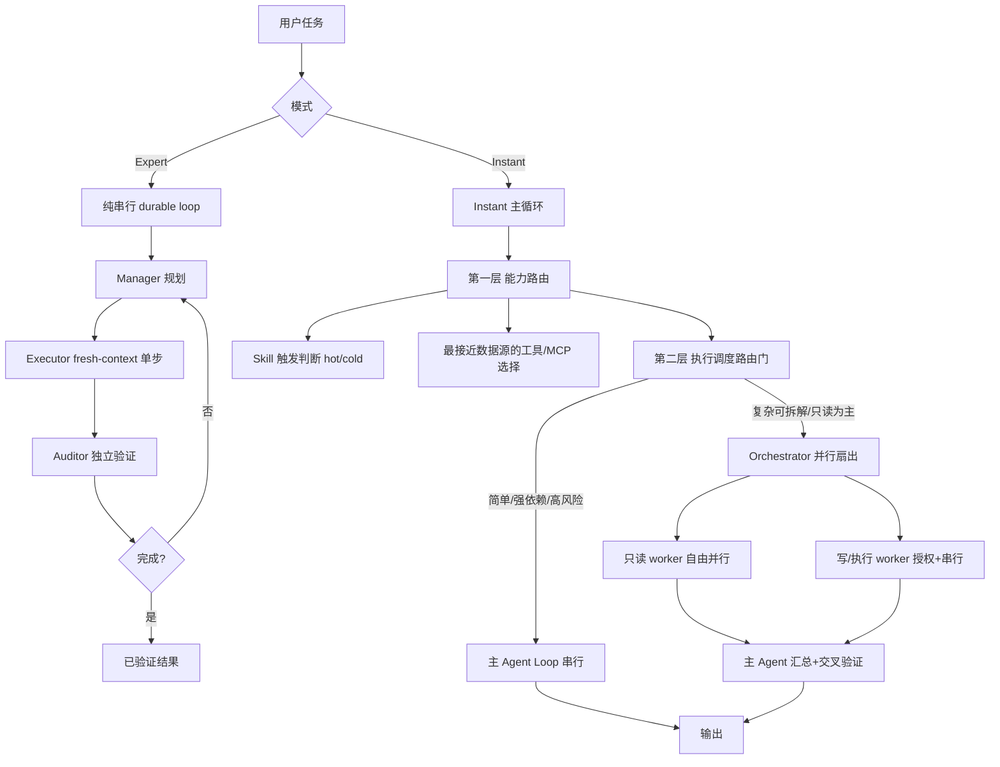

# FoxIR 双模式架构重构 Spec

| 项 | 内容 |
|---|---|
| 文档状态 | **定稿 v1.0**（待确认事项已全部裁定，见 §13） |
| 范围 | Expert 模式串行化剥离 + Instant 模式编排能力引入 + Skills/MCP 能力路由融入 |
| 前置决策 | 门禁可推翻、旧记忆可修正（用户已授权） |
| 关联记忆 | 「FoxIR双模式架构重构需求（细化版）」 |

---

## 1. 背景与问题

### 1.1 Expert 模式的初衷
Expert 模式用于跑**超长任务**（推理步骤 200+），核心价值是**约束力**与**专注力**——一条连续、可验证、不被稀释的推理链，忠实于 LongHorizon-Harness 的 `Plan → Act → Verify → Checkpoint/Recover` 串行 durable loop。

### 1.2 当前问题
为提速，Expert 被加挂了**两套并行子 Agent 机器**，稀释了其专注力，且与 LongHorizon-Harness 的串行本质相悖：

| 并行机器 | 形态 | 位置 |
|---|---|---|
| ManagedRunner 级并行收集 | 计划声明式：Manager 规划里带 `parallel_subtasks`，模板化跑只读 worker | [runner.rs#L876-L1078](file:///e:/VSCode/FoxIR/src/managed/runner.rs#L876-L1078)、[parallel.rs](file:///e:/VSCode/FoxIR/src/managed/parallel.rs) |
| LlmAgent 级编排器 | Agent 自主式：Executor 调 7 个编排工具 spawn/wait 子代理 | [llm_agent.rs#L1400-L1439](file:///e:/VSCode/FoxIR/src/agent/llm_agent.rs#L1400-L1439) |

### 1.3 重构构想（经调研《子Agent使用手册》后修正）
按**深度 vs 广度**正交拆分两个模式：

- **Expert = 深度 / 串行 / durable**：剥离全部并行框架，回归纯串行多轮，忠实 LongHorizon-Harness。
- **Instant = 广度 / 并行 / 拆解**：收到复杂任务时能有效拆解，并切换到对应编排模式（主 Agent Loop ↔ Orchestrator）提效。

此拆分解决了"能力倒置"矛盾：全局只保留**一套**编排实现（迁至 Instant），Expert 回归纯串行。

---

## 2. 目标与非目标

### 2.1 目标
1. Expert 模式彻底移除并行子 Agent 字段与逻辑，回归纯串行 Manager→Executor→Auditor。
2. Instant 模式获得"复杂任务拆解 + 编排"能力，编排器运行时从 Expert 迁移至 Instant。
3. Instant 编排权限分档：只读子代理自由扇出；写/执行子代理需用户显式授权且串行。
4. Instant 路由门：规则预筛 + LLM 拆解判断，简单任务零额外开销。
5. 融入手册 §7 的 Skills/MCP "能力路由"两层决策框架（提示词级，复用现有基建）。
6. 翻转两级门控与相关回归测试；保持 STOP 取消纪律不回退。

### 2.2 非目标
- 不重写编排器运行时（`Orchestrator` 模式无关，仅改门控条件）。
- 不新建代码级 capability router（复用现有 skill 评分）。
- 不引入孙代理（worker 保持 `depth=1, can_spawn=false`）。
- 不改动 Expert 的 Auditor/TaskContract 验证机制（仅剥离并行分支）。

---

## 3. 现状架构事实核对

### 3.1 编排门控（两级）
- **投递门控**：[llm_agent.rs#L264](file:///e:/VSCode/FoxIR/src/agent/llm_agent.rs#L264) `orchestration_allowset(mode, depth)`：`Expert && depth==0` → 7 个编排工具；其余（含 Instant）→ 空集。
- **执行门控**：编排工具 `execute` 首行 `gate(ctx)` + `orch(ctx)`，按 invocation_id 查全局编排器注册表，查不到则 `not_available_in_mode`（[tool/orchestration.rs#L56-L86](file:///e:/VSCode/FoxIR/src/tool/orchestration.rs#L56-L86)）。
- **编排器构造门控**：[llm_agent.rs#L1400](file:///e:/VSCode/FoxIR/src/agent/llm_agent.rs#L1400) 仅 `mode==Expert && depth==0` 时构造并注册 `Orchestrator`。

### 3.2 编排器运行时（模式无关，可直接迁移）
- `Orchestrator::new(env, ...)`（[orchestration.rs#L201](file:///e:/VSCode/FoxIR/src/agent/orchestration.rs#L201)）只吃 provider/tools/目录/配置，无 Expert 专属逻辑。
- **三档权限已实现**：worker allowlist 空 → 只读子集；`allow_write/allow_exec` → 追加写/执行工具（[orchestration.rs#L343-L361](file:///e:/VSCode/FoxIR/src/agent/orchestration.rs#L343-L361)）。
- **写/执行 worker 已强制串行**：`write_gate` 互斥锁（[orchestration.rs#L616-L618](file:///e:/VSCode/FoxIR/src/agent/orchestration.rs#L616-L618)）。
- worker 构造：`mode=Expert, depth+1, can_spawn=false, .without_skills()`（[orchestration.rs#L405-L410](file:///e:/VSCode/FoxIR/src/agent/orchestration.rs#L405-L410)）。
- `SubAgentSpec` 字段：`role/prompt/tools_allowlist/allow_write/allow_exec/model/timeout/max_tokens`（[context.rs#L92-L103](file:///e:/VSCode/FoxIR/src/context.rs#L92-L103)）。

### 3.3 Expert 并行链路（待剥离）
- `ManagerPlan.parallel_subtasks` 字段 + 解析（[manager.rs#L42-L44](file:///e:/VSCode/FoxIR/src/managed/manager.rs#L42-L44)、[#L444](file:///e:/VSCode/FoxIR/src/managed/manager.rs#L444)）。
- `bounded_parallel_collect` + `ParallelOutcome`（[runner.rs#L206-L238](file:///e:/VSCode/FoxIR/src/managed/runner.rs#L206-L238)）。
- 并行收集调用链 + 降级重跑 + `audit_subagent_aggregate`（[runner.rs#L876-L1078](file:///e:/VSCode/FoxIR/src/managed/runner.rs#L876-L1078)）。
- 模板收集 `run_template_collect` / `ParallelEnv`（[parallel.rs](file:///e:/VSCode/FoxIR/src/managed/parallel.rs)）。

### 3.4 Skills/MCP 能力路由基建（已存在，隐式）
- Skill hot/cold 目录 + 相关度评分（trigger+10/name+4/desc+2.5/word+2，阈值 `HOT_MIN_SCORE`）：[skill/mod.rs#L253-L356](file:///e:/VSCode/FoxIR/src/skill/mod.rs#L253-L356)。
- 分层路由：task-matched Skill 驱动本轮时抑制竞争 SOP（[llm_agent.rs#L3098](file:///e:/VSCode/FoxIR/src/agent/llm_agent.rs#L3098)）。
- 任务域路由提示（IR/取证 vs 运维 vs 其他）：[llm_agent.rs#L626-L631](file:///e:/VSCode/FoxIR/src/agent/llm_agent.rs#L626-L631)。
- MCP 工具动态注册进共享 ToolRegistry：[main.rs#L383-L394](file:///e:/VSCode/FoxIR/src/main.rs#L383-L394)。
- worker `.without_skills()`：Skill 归主 Agent，worker 只收集数据（符合手册 §7.3）。

### 3.5 Instant 运行入口
- 非 managed 分支 → `state.runner.run(...)`（[server.rs#L1794-L1806](file:///e:/VSCode/FoxIR/src/server.rs#L1794-L1806)）。路由门可置于此处之前，或内置于 Runner/LlmAgent 主循环。

### 3.6 取消纪律（刚修复，不可回退）
- `cancelled_fut`（[runner.rs#L196-L204](file:///e:/VSCode/FoxIR/src/managed/runner.rs#L196-L204)）+ Manager/Executor/Auditor 三处 `tokio::select!` 竞速。Instant 新编排必须继承同等纪律。

---

## 4. 目标架构



**核心不变量**：
- 能力路由（第一层）横切两个模式，与 Expert/Instant 之分无关。
- 执行调度（第二层）：Expert 恒串行 Loop；Instant 按路由门决定 Loop/Orchestrator。
- **能力路由信号 ≠ 拆解信号**（手册 §7.3：PPT 任务触发 pptx Skill 但仍走主 Loop，不扇出）。

---

## 5. 设计决策（已对齐）

| # | 决策点 | 选定方案 |
|---|---|---|
| D1 | Instant 编排权限边界 | 分档：只读子代理自由扇出；写/执行子代理需用户显式授权且串行 |
| D2 | 路由触发方式 | 规则预筛（多目标/多模块/多数据源关键词）命中后，LLM 做一次拆解判断；简单任务零开销 |
| D3 | Expert 剥离范围 | 彻底移除并行字段与逻辑，回归纯串行 |
| D4 | Skills/MCP 能力路由 | 融入，提示词级两层决策框架，复用现有基建，不新建代码路由器 |
| D5 | 编排器运行时 | 不重写，门控从 Expert 翻转至 Instant |
| D6 | 子代理嵌套 | 保持 depth=1、can_spawn=false、without_skills |

---

## 6. 改造范围（分模块）

### 6.1 Expert 剥离（D3）
| 文件 | 改动 |
|---|---|
| [runner.rs](file:///e:/VSCode/FoxIR/src/managed/runner.rs) | 删 `bounded_parallel_collect`、`ParallelOutcome`、L876-L1078 并行分支、`audit_subagent_aggregate` 调用 |
| [manager.rs](file:///e:/VSCode/FoxIR/src/managed/manager.rs) | 删 `ManagerPlan.parallel_subtasks` 字段、解析逻辑、`PendingPlan` 内对应字段 |
| [parallel.rs](file:///e:/VSCode/FoxIR/src/managed/parallel.rs) | 整文件废弃（模板收集为 Expert 特有；Instant 走 agent 自主工具模式，不复用） |
| [task_contract.rs](file:///e:/VSCode/FoxIR/src/managed/task_contract.rs) | 清理 `orchestrator_plan` 中 parallel 相关持久化（如有） |

> 区分：Expert 旧并行 = **计划声明式**（plan.parallel_subtasks → 模板收集）；Instant 新编排 = **Agent 自主式**（LLM 调 spawn/wait 工具）。两者路径不同，故 parallel.rs 随 Expert 剥离废弃，orchestration.rs 保留迁 Instant。

### 6.2 门控翻转（D5）
| 文件 | 改动 |
|---|---|
| [llm_agent.rs#L264](file:///e:/VSCode/FoxIR/src/agent/llm_agent.rs#L264) | `orchestration_allowset`：`Expert && depth==0` → `Instant && depth==0` 返回 ALL_ORCH；Expert 返回空 |
| [llm_agent.rs#L1400](file:///e:/VSCode/FoxIR/src/agent/llm_agent.rs#L1400) | 编排器构造门控：`mode==Expert` → `mode==Instant`（depth==0 不变） |
| [main.rs#L540-L548](file:///e:/VSCode/FoxIR/src/main.rs#L540-L548) | 复核 mode 选择逻辑：编排能力不再绑定 `orchestration_enabled` 到 Expert |
| [orchestration.rs#L405-L410](file:///e:/VSCode/FoxIR/src/agent/orchestration.rs#L405-L410) | worker mode 语义复核（depth=1 时 allowset 恒空，mode 取值不影响安全；建议固定为 Instant 或引入 Worker 语义） |

### 6.3 Instant 路由门（D2，动作4 — 唯一新设计）
置于 Instant 主循环入口（[server.rs#L1794](file:///e:/VSCode/FoxIR/src/server.rs#L1794) 之前或 Runner 内）：

```
1. 规则预筛（零 LLM 开销）：
   - 信号：多目标（多个 IP/主机/文件/模块）、多数据源、显式"分别/并行/各自"措辞
   - 命中 → 进入步骤 2；未命中 → 直接走原 Instant 主 Loop（零额外开销）
2. LLM 拆解判断（仅命中时一次）：
   - 输出：{是否拆解, 子任务列表[{role, task, 权限档}], 汇总策略}
   - 不解拆 → 主 Loop；拆解 → Orchestrator 扇出
3. 正交约束：能力路由（选 skill/工具）独立于拆解判断，先于拆解判断完成
```

### 6.4 权限分档（D1）
- 复用 `SubAgentSpec.allow_write/allow_exec` + `write_gate` 串行（已实现）。
- **新增"写需用户显式授权"闸**：`spawn_subagent` 当 `allow_write||allow_exec==true` 时，先过权限系统（PendingMap / 预授权 profile），未授权则拒绝或降级为只读。落点：[tool/orchestration.rs#L78-L86](file:///e:/VSCode/FoxIR/src/tool/orchestration.rs#L78-L86) `SpawnSubagentTool::execute`。
- 只读 worker：自由并行，无需授权。

### 6.5 能力路由提示词（D4）
在 Expert Manager 与 Instant 主 Agent 系统提示加入统一"两层决策"段（编码手册 §7.4 顺序）：
- 第一层：先判 Skill 触发（hot 自动注入 / cold 用 `skill_read_file` 按需）→ 再按"最接近数据源"选工具/MCP（显式举例：查邮件用 M365 而非浏览器点 Outlook；查远程日志用 WinRM 而非 RDP）。
- 第二层：执行调度（Expert 恒串行；Instant 按路由门）。
- 复用现有 skill 评分与 TASK-DOMAIN ROUTING，不新建代码路由器。

---

## 7. 关键设计细节

### 7.1 能力路由 vs 拆解路由正交（最大陷阱）
手册 §7.3 明确："修改一个 PPT → pptx Skill → 主 Agent Loop"。**触发 Skill ≠ 需要拆解编排**。路由门必须先完成能力路由，再独立判断拆解；skill-trigger 关键词仅作为"复杂度信号之一"，不得直接等于拆解触发。否则单文档 Skill 任务会被误扇出。

### 7.2 取消纪律继承
Instant 编排必须继承 `cancelled_fut` 竞速：
- 路由门 LLM 判断、`wait_subagent`、子代理 LLM 调用均需 STOP 竞速。
- 修复既有孤儿问题：STOP 时父级 abort 后，子代理 `tokio::spawn` 任务需联动取消（`SubAgentHandle.cancel` + `root_ended` flag），避免孤儿 worker 继续烧 token。

### 7.3 子代理上下文预算
worker `.without_skills()` 保持精简；Instant 主 Agent 同时承载 skill catalog + 编排工具定义 + 路由指引，需复核 `skill_catalog_max` / `hot_top_k` 预算，避免挤占任务上下文。

### 7.4 MCP 工具在 worker 中的边界
只读 MCP 工具可投递给只读 worker；写/执行类 MCP 工具留主 Agent 或走授权档串行，防止多 worker 并行改同一资源（手册 §9 反模式）。

---

## 8. 盲点与风险

| # | 风险 | 缓解 |
|---|---|---|
| A | 能力路由与拆解信号混淆 → 单文档任务被误扇出 | 两判断正交、顺序固定（§7.1） |
| B | Instant 失去"永远快/省" | 规则预筛零开销、保守默认、worker 数硬上限 |
| C | 路由误判（便宜模型过度/不足拆解） | 保守默认 + 拆解计划显式呈现 + 用户可否决 |
| D | Expert 剥离是行为回归 | 确认无持久化 contract 依赖 parallel 字段；测试迁移 |
| E | 取消纪律回退 / 孤儿 worker | 继承 cancelled_fut + 子代理联动取消（§7.2） |
| F | UI/事件管线：Instant 子代理进度透传 | 已裁定 D7：透传 worker 级里程碑+汇总，不透传逐 token 流 |
| G | 两种拆解哲学趋同（Expert 串行轮次 vs Instant 并行 worker） | 提示词明确区分 |

---

## 9. 测试策略

### 9.1 需翻转的回归测试
| 测试 | 位置 | 改动 |
|---|---|---|
| `orchestration_allowset(Instant,0).is_empty()` | [llm_agent.rs#L3415](file:///e:/VSCode/FoxIR/src/agent/llm_agent.rs#L3415) | 翻转为非空；Expert 翻转为空 |
| "Step 2a opens gate for Expert root only" | [llm_agent.rs#L3416-L3432](file:///e:/VSCode/FoxIR/src/agent/llm_agent.rs#L3416) | 改为 Instant root |
| `gate_instrument_delivery_reads_ctx_not_agent_static_mode` | [llm_agent.rs#L3468-L3476](file:///e:/VSCode/FoxIR/src/agent/llm_agent.rs#L3468) | 反转：Expert ctx 必须空 allowset |
| `orchestration_tools_unavailable_without_orchestrator` | [tool/orchestration.rs#L212](file:///e:/VSCode/FoxIR/src/tool/orchestration.rs#L212) | 保留（无编排器仍拒绝） |
| parallel.rs 只读 worker 断言 | [parallel.rs#L259](file:///e:/VSCode/FoxIR/src/managed/parallel.rs#L259) | 随文件废弃删除 |

### 9.2 需迁移/删除的测试
- [phase0_acceptance.rs](file:///e:/VSCode/FoxIR/src/phase0_acceptance.rs)：依赖 `run_template_collect`/`parallel_subtasks` 的用例迁至 Instant 编排路径或删除。
- [orch_selftest.rs](file:///e:/VSCode/FoxIR/src/orch_selftest.rs)：模板收集自测随 parallel.rs 废弃处理。

### 9.3 新增测试
- Instant 路由门：简单任务不扇出（零开销）；复杂任务扇出只读 worker。
- 权限分档：只读 worker 自由并行；写 worker 未授权被拒/降级；写 worker 串行。
- 正交性：PPT 类任务触发 skill 但走主 Loop（不扇出）。
- 取消：Instant 编排中 STOP 即时中断、无孤儿 worker。
- Expert 纯串行：无 parallel_subtasks 派发，STOP 仍即时。

---

## 10. 分阶段实施计划

| 阶段 | 内容 | 可独立验证 | 依赖 |
|---|---|---|---|
| P1 | Expert 剥离并行字段与逻辑（6.1） | ✅ 编译 + Expert 串行回归 | 无 |
| P2 | 门控翻转 Expert→Instant（6.2） | ✅ 门控单测翻转 | P1 |
| P3 | Instant 编排器接入 + spawn/wait 工具可用 | ✅ Instant 手动扇出 | P2 |
| P4 | 权限分档：写需授权 + 串行（6.4） | ✅ 分档单测 | P3 |
| P5 | Instant 路由门：规则预筛 + LLM 拆解判断（6.3） | ✅ 路由门单测 | P3 |
| P6 | 能力路由提示词框架（6.5） | ✅ 提示词评审 | P5 |
| P7 | 取消纪律继承 + 孤儿修复（7.2） | ✅ STOP 集成测试 | P3 |
| P8 | 测试迁移 + 记忆/文档更新 | ✅ 全量测试 | P1-P7 |

> 顺序原则：先剥离（P1，降风险）→ 再翻转门控（P2）→ 再接入与增强（P3-P7）→ 收尾（P8）。

---

## 11. 验收标准

1. **Expert**：纯串行多轮，无 `parallel_subtasks` 派发；STOP 即时（保留取消竞速）；Auditor 验证链不变。
2. **Instant 简单任务**：零额外开销，不扇出，行为与重构前一致（除提示词增强）。
3. **Instant 复杂任务**：能拆解并并行只读 worker；主 Agent 汇总 + 交叉验证。
4. **权限分档**：写/执行 worker 需显式授权且串行；只读 worker 自由并行。
5. **正交性**：Skill 触发不等于拆解触发（PPT 任务走主 Loop + skill）。
6. **取消**：Instant 编排中 STOP 即时中断，无孤儿 worker 残留。
7. **门控**：Expert ctx 编排 allowset 为空；Instant depth0 ctx 为 ALL_ORCH；worker（depth≥1）恒空。
8. **编译与测试**：`cargo build --release` 通过；翻转/迁移/新增测试全绿。

---

## 12. 记忆与文档更新

- 更新「FoxIR双模式架构重构需求（细化版）」为本 spec 的最终方案。
- 修正/废止旧决策「Instant 模式禁止直接引入子 Agent 编排能力」（已被本重构推翻）。
- 更新「工具注册表两级门控规范」：门控方向 Expert→Instant 翻转。
- 保留「Rust 异步阻塞调用取消保护规范」并扩展至 Instant 编排路径。

---

## 13. 定稿决策（推荐默认值）

原 3 项待确认事项已裁定如下，作为实施基准：

### D7 UI 事件管线 —— 透传 worker 级里程碑 + 汇总，不透传逐 token 流
- **决策**：Instant 编排时向前端透传 **worker 级里程碑事件**（spawn 启动 / 完成 / 失败）与**最终汇总**；**不**透传 worker 内部逐 token 流。
- **理由**：Instant 是交互模式，用户需看到并行进展（否则形同卡死）；但逐 token 透传会使 UI 混乱且增加管线复杂度。里程碑事件可复用现有 EventPump，成本低、可控性好。
- **取舍**：优于"仅透传汇总"（无进展反馈），优于"全透传"（UI 噪声大）。 Expert 旧 `parent_tx=None` 策略不再沿用于 Instant。

### D8 worker mode 语义 —— 固定为 Instant
- **决策**：翻转后 worker 的 `mode` 固定为 `Instant`（[orchestration.rs#L405-L410](file:///e:/VSCode/FoxIR/src/agent/orchestration.rs#L405-L410) 由 `Expert` 改为 `Instant`）。
- **理由**：翻转后仅 Instant 派生 worker，mode=Instant 语义统一；`depth=1` 保证编排 allowset 恒空（无编排工具），`.without_skills()` 已禁用 skill 注入，无回归风险。
- **验证项（P2）**：确认无其他 mode-gated 行为（如系统提示分支）因 worker mode 改变而回退。

### D9 路由门落点 —— 内置于 LlmAgent 主循环
- **决策**：路由门（规则预筛 + LLM 拆解判断）内置于 LlmAgent 主循环入口（`mode==Instant && depth==0`），与编排器构造门控同址。
- **理由**：可直接复用 InvocationContext（mode/depth/取消 flag/ended flag）与已注册的 Orchestrator，避免在 server.rs 重复构造上下文；与编排器构造逻辑同址，便于维护与测试。

---

## 14. 定稿说明

本 spec v1.0 已含全部设计决策（D1-D9），可进入实施。实施顺序遵循 §10 的 P1-P8；每阶段以 §9 测试策略与 §11 验收标准为门禁。实施前须按 §12 更新相关记忆（废止旧「Instant 禁止编排」决策、翻转门控规范）。
