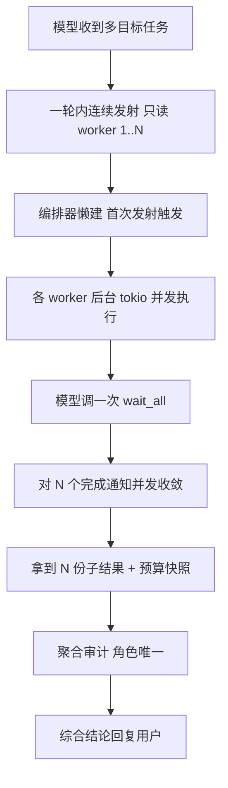

# FoxIR Instant 常态多子 Agent 并行 —— 设计文档

| 项 | 内容 |
|---|---|
| 文档状态 | **v0.2 评审通过（契约选 A：7 工具常驻 + 并行度 4；反向审阅 3 硬伤已并入 §3/§10/§11）** |
| 产出方式 | Superpowers `brainstorming` skill（架构路径）+ 代码级取证 |
| 基线文档 | [双模式编排重构 校验加固版 v1.1-hardened](file:///e:/VSCode/FoxIR/docs/superpowers/specs/2026-09-12-dual-mode-orchestration-refactor-design.md)（本文在其之上工作，**修订其 D10**） |
| 本文定位 | 在已落地的双模式编排之上，为 **Instant 模式**增加「常态多子 Agent 并行工作」能力；**Expert 模式串行结构一行不动**；**不削弱 Instant agent loop 现有能力**；可**一键回滚** |
| 核心冲突点 | 父文档 D10「预筛命中才投递 7 工具，简单任务零开销」 vs 本需求「常态可用并行」。本文以 **常态投递 + 懒建编排器** 重划开销边界（详见 §3 D-A） |
| 回滚承诺 | 主回滚开关 = 恢复一行门控条件（`orch_candidate` 里的 `&& 预筛`），即逐字节回到 v1.1-hardened 行为（详见 §9） |
| 日期 | 2026-09-13 |

---

## 0. 阅读指引与发现索引

本设计基于对 FoxIR 与 PCBuddy-Legacy 的对照取证。结论先行：**FoxIR 的并行底座其实已经存在**（子代理工具已是「发射即返回」、worker 已并发、已限流、已汇聚事件、读 worker 不碰写锁），真正挡住「常态并行」的是**三道门**。本设计逐门拆除。

| ID | 发现 | 落点 |
|---|---|---|
| F1 | 决定性根因：规则预筛是**硬开关**，不命中则编排工具从模型可见定义里剥离、且编排器不构造 | §3 D-A |
| F2 | 使用范式根因：子代理工具描述暗示「派一个等一下」，回收只收单个 `run_id` → 模型走串行节奏 | §3 D-C |
| F3 | 发射根因：子代理工具未声明只读 → 多个发射走串行分支（但非阻塞，仅浪费墙钟，不损并行度） | §3 D-C（可选） |
| F4 | 🔴 写路径雷：worker 超时从**派遣即计时**且**含排队拿写锁时间**，超时直接丢弃 future → 常态并行高频触发「排队即超时 / 半写」 | §3 D-B |
| F5 | 🔴 回收雷（本次验证坐实）：等待类工具无超时豁免（默认普通档），**静默 60 秒即被看门狗掐掉**、300 秒墙钟再掐；而子代理默认 300 秒才回 → 常态并行下几乎必崩 | §3 D-C |
| F6 | `has_inflight_workers` 只守「消费端掉线」，**守不住墙钟超时与静默看门狗** | §3 D-C（佐证 F5 必须靠超时档豁免解） |
| F7 | 崩溃恢复按角色**幂等复用**旧结果 + 聚合审计对**重复角色判存疑** → 常态并行需角色唯一 | §3 D-E |
| F8 | 开关语义：并行能力真正主开关是 `can_spawn`（默认开），受配置 `modes.instant/expert.orchestration` 双键回退控制 | §3 D-F |
| F9 | 前缀缓存：去掉预筛后工具集在每个 Instant 运行里**恒定**，反而比「随预筛命中与否在运行间跳变」更稳定 | §3 D-A（论证） |

---

## 1. 背景、目标与非目标

### 1.1 背景
实测中 PCBuddy-Legacy 能在实验环境里派遣多个子 Agent 并行干活，FoxIR 做不到。取证表明差异不在「有没有并行底座」，而在「并行能力是否常态可达 + 回收范式是否匹配」。**对照事实**：PCBuddy 无编排器对象，是因为它的子代理管理器是**进程级单例**（启动建一次），发射即返回、结果靠异步推回父会话，因此它「不需要门控、也不阻塞主循环」。FoxIR 的编排器是**每运行实例**，绑定该运行的私有事件通道与取消标志——这是刻意设计，**不应照搬单例物理形态**（见父文档 §2.1 与本文 §5）。我们借的是 PCBuddy 的**可用性**（工具常态在、不门控），不是它的**物理形态**。

### 1.2 目标
1. **Instant 模式**下，模型可在**一轮里连续发射多个只读子 Agent 并行执行**，并以一次收敛式回收拿齐结果。
2. 并行能力**常态可用**，不依赖用户措辞命中规则预筛。
3. 端到端**降低多目标取证的墙钟时间**（这是本改造唯一的收益衡量维度）。

### 1.3 非目标（明确不做）
1. **不改 Expert 模式**：`ManagedRunner` 串行编排链一行不动（隔离红线）。
2. **不削弱 Instant agent loop**：对循环主干只做一件事——不再把编排工具从模型可见定义里剥离（增加可见能力，不改执行行为）。
3. **不追求无界并行**：保留并发上限（DoS/成本防线），仅按需微调数值。
4. **暂缓前端可视化渲染**：子代理预算卡等 UI 暂缓，但**后端事件照发**（沿用既定决策）。
5. **不引入 PCBuddy 的推送式回收**（announce）：维持拉取式（`wait`），因推送式要动主循环，违背非目标 2。

---

## 2. 现状事实核对（逐条附代码证据）

| 声明 | 核验 | 证据 |
|---|---|---|
| `can_spawn` 默认 true（Instant 根） | ✅ 默认开；受配置门控可关 | 主开关来源 [main.rs#L596](file:///e:/VSCode/FoxIR/src/main.rs#L596)；回退链 [config.rs#L309-L312](file:///e:/VSCode/FoxIR/src/config.rs#L309-L312)；专家默认「on」 [config.rs#L428](file:///e:/VSCode/FoxIR/src/config.rs#L428) |
| 编排候选四条件含规则预筛 | ✅ 成立 | [llm_agent.rs#L1720-L1723](file:///e:/VSCode/FoxIR/src/agent/llm_agent.rs#L1720-L1723) |
| 预筛是硬开关（不命中剥离工具+不建编排器） | ✅ 成立（F1） | 预筛定义 [llm_agent.rs#L502-L522](file:///e:/VSCode/FoxIR/src/agent/llm_agent.rs#L502-L522)；剥离 [llm_agent.rs#L1742-L1743](file:///e:/VSCode/FoxIR/src/agent/llm_agent.rs#L1742-L1743)；急建 [llm_agent.rs#L1848-L1892](file:///e:/VSCode/FoxIR/src/agent/llm_agent.rs#L1848-L1892) |
| 子代理发射即返回、非阻塞 | ✅ 底座已在 | [tool/orchestration.rs#L79-L101](file:///e:/VSCode/FoxIR/src/tool/orchestration.rs#L79-L101) |
| worker 超时从派遣计时、含写锁排队 | ✅ 成立（F4） | future 包住写锁见 [orchestration.rs#L610-L622](file:///e:/VSCode/FoxIR/src/agent/orchestration.rs#L610-L622) + 写锁获取 [orchestration.rs#L819-L820](file:///e:/VSCode/FoxIR/src/agent/orchestration.rs#L819-L820) |
| 等待类工具无超时豁免 | ✅ 成立（F5） | [tool/orchestration.rs#L104-L117](file:///e:/VSCode/FoxIR/src/tool/orchestration.rs#L104-L117)（未覆盖 `timeout_stage`）→ 默认普通档 [tool/mod.rs#L131](file:///e:/VSCode/FoxIR/src/tool/mod.rs#L131) |
| 工具级静默看门狗 60s / 墙钟 300s 掐断 | ✅ 成立（F5） | 有效超时计算 [llm_agent.rs#L3443-L3449](file:///e:/VSCode/FoxIR/src/agent/llm_agent.rs#L3443-L3449)；静默掐断 [llm_agent.rs#L3546-L3559](file:///e:/VSCode/FoxIR/src/agent/llm_agent.rs#L3546-L3559)；墙钟掐断 [llm_agent.rs#L3588-L3592](file:///e:/VSCode/FoxIR/src/agent/llm_agent.rs#L3588-L3592)；普通档静默 60s [tool/mod.rs#L122](file:///e:/VSCode/FoxIR/src/tool/mod.rs#L122)；工具超时默认 300s [config.rs#L595](file:///e:/VSCode/FoxIR/src/config.rs#L595) |
| `has_inflight_workers` 仅守掉线 | ✅ 成立（F6） | 调用全在掉线分支 [llm_agent.rs#L3533](file:///e:/VSCode/FoxIR/src/agent/llm_agent.rs#L3533) / [#L3568](file:///e:/VSCode/FoxIR/src/agent/llm_agent.rs#L3568) / [#L3579](file:///e:/VSCode/FoxIR/src/agent/llm_agent.rs#L3579) / [#L2150](file:///e:/VSCode/FoxIR/src/agent/llm_agent.rs#L2150) / [#L2322](file:///e:/VSCode/FoxIR/src/agent/llm_agent.rs#L2322)；定义 [orchestration.rs#L958](file:///e:/VSCode/FoxIR/src/agent/orchestration.rs#L958) |
| 按角色幂等复用 + 重复角色审计存疑 | ✅ 成立（F7） | 复用 [orchestration.rs#L459-L461](file:///e:/VSCode/FoxIR/src/agent/orchestration.rs#L459-L461)；审计 [orchestration.rs#L165-L167](file:///e:/VSCode/FoxIR/src/agent/orchestration.rs#L165-L167) |
| 并发上限默认 4 | ✅ 成立 | 限流 [orchestration.rs#L475-L479](file:///e:/VSCode/FoxIR/src/agent/orchestration.rs#L475-L479)；默认值 [config.rs#L430](file:///e:/VSCode/FoxIR/src/config.rs#L430) |

**PCBuddy 对照**：`spawn` 发射即返回、结果靠 `announce` 推回父会话，故回收**不在循环里阻塞**，天生规避 F5；代价是尽力而为、崩溃即丢（无并发上限/无写锁/无持久化/无预算卡）。FoxIR 反过来——**能力内核更强，但拉取式回收必须自建超时豁免**（本文 D-C）。

---

## 3. 核心决策（D-A ~ D-F）

### D-A〔修订父文档 D10〕常态投递 + 事件泵懒起
**决策**：把「是否交付编排能力」从 `can_spawn && 预筛命中` 改为 **`can_spawn && mode==Instant && depth==0`（不含预筛）**——Instant 根运行**常态**把 7 个编排工具交付给模型；规则预筛**降级为系统提示里的软引导**（“此类任务适合并行扇出”），不再是硬门。

**与 D10 的冲突与调和**：D10 用预筛换「简单任务零开销」。本决策改为守住**常驻任务零开销**、**放弃 token 零开销**（这是对 v1.1 验收 #2 的契约弱化，须验收 owner 认可，见 §10/§11）：
- **常驻任务零开销**：编排器结构体在运行入口照常构造（仅数个空互斥量 + 两条通道，成本极小），但**事件泵后台任务改懒起**——首个 worker 注册时才 `tokio::spawn` 事件泵（[agent/orchestration.rs#L237](file:///e:/VSCode/FoxIR/src/agent/orchestration.rs#L237)）。无发射的运行不启任何常驻任务，仅背一个极小编排器壳。
- **为何不选「完全不建编排器、`spawn` 首调时建」**：发射工具执行时上下文只有工具入参，**拿不到运行入口才组装的构造配方**（provider / 工具注册表 / 模型配置 / 父事件通道，见 [llm_agent.rs#L1848-L1892](file:///e:/VSCode/FoxIR/src/agent/llm_agent.rs#L1848-L1892)）；硬做需另设「每运行构造上下文槽位」，复杂度与风险不划算。故采用「结构入口建（廉价）+ 泵懒起」的低风险落地。
- **token 开销可控**：仅多 7 个精简 schema 常驻。且**缓存反而更稳**：去预筛后 Instant 工具集在每个运行恒定，消除了「随预筛命中与否在运行间跳变」这一打断稳定系统提示前缀缓存的元凶（F9）。工具定义 token 仍须按预算规范强制扣减（沿用既有账本）。

**回滚**：把 `orch_candidate` 恢复 `&& 预筛` 一行即回到 D10 原行为（§9）。

### D-B〔拆 F4 雷〕并行范围限定只读；写/执行保持串行且不并发发射
**决策**：常态并行**只面向只读子 Agent**。写/执行（`allow_write || allow_exec`）子 Agent：
1. 仍由全局写锁强制串行（现状保留）；
2. **不纳入并发扇出/并发发射**——发射即要求单独授权（现状 `request_spawn_authorization`），且建议其超时从「获得写锁后」起算，或移植 PCBuddy 的「取消信号→宽限→终止」软取消，避免排队吃掉预算导致半写。

这与用户已勾选「保留写串行」自洽，把最硬的半写/超时雷从「常态触发」降回「罕见」。

### D-C〔拆 F2/F5 雷〕收敛式回收 + 超时档豁免（本设计的地基）
**决策**：
1. **新增 `wait_all`**（拉取式、单工具一次调用内部对多个 `run_id` 并发收敛）：模型一轮连发多个 `spawn_subagent` 拿到若干 `run_id`，再调一次 `wait_all` 收齐——契合「发射即返回、后台并发」，不依赖主循环的并发分支。**实现要点（防丢通知，反向审阅硬伤 2）**：完成通知 `notify_waiters` 只唤醒「当时」的等待者，后到者若不先查终态会永久错过（[agent/orchestration.rs#L659](file:///e:/VSCode/FoxIR/src/agent/orchestration.rs#L659)）；故 `wait_all` 对每个 `run_id` **先读其结果是否已为终值**（handle 已存 `Some(result)` 直接纳入），**未完成才订阅完成通知后 `await`**。**存活上界约束**：worker 受 `default_timeout_secs`（默认 300s，[config.rs#L431](file:///e:/VSCode/FoxIR/src/config.rs#L431)）上界，须保证等待工具的静默豁免（看门狗档 600s，[tool/mod.rs#L124](file:///e:/VSCode/FoxIR/src/tool/mod.rs#L124)）> worker 最长存活，避免 wait 被自身看门狗误杀；若允许自定义 `spec.timeout`，须令其 < 600s 或等待期持续推心跳（D-C 第 3 项）。
2. **给 `wait_subagent` / `wait_all` 覆盖 `timeout_stage → 看门狗档`**：墙钟≈无上限（24h）、静默容忍抬到 600 秒（[tool/mod.rs#L113/L124](file:///e:/VSCode/FoxIR/src/tool/mod.rs#L113-L124)），稳稳覆盖子代理 300 秒生命周期（F5/D-C 直接解）。
3. **等待期间推心跳**（双保险）：`wait` 阻塞时每 10–15 秒向进度通道推一条「waiting for run_id …」，复位静默计时，防任何极端长等被看门狗误杀。
4. **改子代理工具描述**：从「派一个然后等待」改为「复杂多目标任务：**一轮内连续发射多个只读 worker，再 `wait_all` 收齐**」，用提示词纠正串行范式（F2）。
5. **（可选）给 `spawn_subagent` 声明只读**：令多个发射进入并发批（F3）；须先核实其副作用（只读名集合 + 并发批判定，且编排工具名随后被剔除，预计无泄漏）。此项默认**不做**，留待 `wait_all` 验证后按需追加。

### D-E〔拆 F7 雷〕角色唯一性
**决策**：发射时校验 `role` 在同一运行内唯一；对**非终值**（仍在跑/待跑）的重名角色拒绝或自动加唯一后缀，避免误复用旧结果与聚合审计存疑。写进工具校验 + 描述引导。

### D-F〔开关语义，解 F8 歧义〕
**决策**：明确「Instant 并行主开关 = `can_spawn`」，由 `modes.instant.orchestration`（缺省回退 `modes.expert.orchestration`）驱动；文档化该回退链，避免「配了开关仍做不到」。并行度目标值：**确认保持 4**（灰度按数据再调，不照搬 PCBuddy 无上限）。

### D-G〔前端，沿用既定〕
**决策**：子代理终态事件（预算更新、完成/失败、结果广播）**照发**；右侧可视化渲染**暂缓**。后端数据链路完整保留，UI 待后续独立任务接入。

---

## 4. 目标数据流（Instant 常态并行一轮）

关键：**发射非阻塞、并发在执行侧、回收一次收敛**。写/执行 worker 走 D-B 串行支路，不入并发扇出。

---

## 5. 不触碰清单（红线）
1. **Expert `ManagedRunner` 串行编排链**：一行不动。全程限定 `mode==Instant && depth==0`；`orchestration_allowset` 对 Expert 仍返回空（[llm_agent.rs#L482-L490](file:///e:/VSCode/FoxIR/src/agent/llm_agent.rs#L482-L490)）。
2. **`has_inflight_workers` 的注册表查询语义**：保留（掉线时若仍有在飞 worker 不拆解运行）。
3. **主循环工具执行主干**（并发/串行分支判定）：不改；本设计只新增「编排工具的超时档元数据覆盖」，属工具自描述，非循环逻辑。
4. **子代理 mode = 专家**：沿用父文档 D8′，不翻转（避免调试断言 panic，见父文档 §2.2）。

**「不削弱 Instant loop 能力」论证**：对循环的全部改动 = 不再从模型可见定义里剥离那 7 个编排工具（增加**可见能力**）；回收超时靠**工具元数据覆盖**解决；扇出引导靠**提示词**。均不改工具执行的调度/超时/重试主干语义。普通（非扇出）任务的**循环执行行为逐字节不变**；其唯一新增成本是一个极小编排器结构体（**无常驻任务**、事件泵不启），不改任何工具调度/超时/重试语义。

---

## 6. 完整改动清单（按文件，精确落点留 `writing-plans`）

| 文件 | 改动 | 关联 |
|---|---|---|
| [llm_agent.rs](file:///e:/VSCode/FoxIR/src/agent/llm_agent.rs) | `orch_candidate` 去 `&& 预筛`（L1720-1723）；构建门改「常态候选」；事件泵由入口急起改**首 worker 懒起**（编排器结构仍在入口构造，L1848-1892）；预筛降级为软提示注入；扇出提示词（L1041-1045） | D-A/D-C |
| [tool/orchestration.rs](file:///e:/VSCode/FoxIR/src/tool/orchestration.rs) | 子代理发射描述改（鼓励一轮连发）+ 角色唯一校验；`WaitSubagentTool` 覆盖 `timeout_stage → 看门狗`；新增 `WaitAllSubagentsTool`（`run_ids[]`，内部并发收敛）；（可选）发射工具 `is_read_only` | D-B/C/E |
| [agent/orchestration.rs](file:///e:/VSCode/FoxIR/src/agent/orchestration.rs) | 事件泵懒起（编排器构造不自动起泵，首 worker 时起）；`wait_all` 内核：对多 handle 完成通知并发 join；写/执行 worker 超时起算或软取消（D-B） | D-A/B/C |
| [tool/mod.rs](file:///e:/VSCode/FoxIR/src/tool/mod.rs) | 无改（复用现成看门狗档语义） | D-C |
| [config.rs](file:///e:/VSCode/FoxIR/src/config.rs) | 并行度默认值（若评审门定 6）；主开关文档化 | D-F |
| 测试 | 见 §7 | — |

---

## 7. 测试策略

**需翻转（随 D-A）**：断言「预筛未命中则不投递/不建编排器」的既有用例（父文档 §4 列，如 `gate_open_delivers_all_after_step2a` 语义）改为「Instant 常态候选即投递；编排器懒建（首发射才构造）」。

**新增**：
1. **常态投递 + 懒建**：Instant 根无预筛命中 → 7 工具投递但**编排器未构造**；首次发射 → 构造 + 事件泵起；非 Instant / depth≥1 → 不投递、不构造（守 Expert 隔离）。
2. **回收超时豁免（F5 回归）**：模拟 worker 运行 >60s 且 >工具默认超时，`wait_subagent`/`wait_all` **不被静默看门狗与墙钟掐断**（覆盖 `timeout_stage` 生效 + 心跳复位）。
3. **`wait_all` 一次收敛**：一轮发射 N 个只读 worker，`wait_all` 返回 N 份终值；任一失败/超时按终态回收不阻塞其余。
4. **角色唯一（F7）**：重名非终值角色发射被拒/加后缀；聚合审计无「重复角色存疑」。
5. **写路径不并发（D-B/F4）**：`allow_write/allow_exec` 不进入并发扇出；并发上限只作用只读扇出。
6. **并行度限流**：超过 `max_concurrent` 的发射返回明确错误、不失控。

---

## 8. 验收标准
1. Instant 多目标任务可**一轮并发发射 ≥2 只读子 Agent 并行执行**，端到端墙钟显著低于串行（见 §10 量化门槛）。
2. 回收**不再出现「等待被工具超时/看门狗掐断」错误**（F5 清零）。
3. **Expert 行为逐字节不变**；非扇出的 Instant 普通任务**无常驻任务、结构开销可忽略**（编排器壳极小、事件泵不启）。
4. 不触发半写/证据损失（写路径串行、并行仅只读）。
5. 角色唯一、聚合审计一致。
6. 前端事件照发（不渲染不报错），数据链路完整。

---

## 9. 回滚设计（满足「随时可退」）

**分层回滚，主开关单点**：
- **一级（一键，推荐）**：恢复 `llm_agent.rs` 里 `orch_candidate` 的 `&& 预筛`（一行条件）→ 立即回到 v1.1-hardened「预筛命中才扇出」的原行为。
- **二级（配置）**：把 `modes.instant.orchestration` / `modes.expert.orchestration` 置 `off` → `can_spawn=false`，编排工具整体不交付、不构造。

**其余改动均设计为「纯增量、默认路径不触发、保留无害」**：`wait_all` 是新工具（不调用即无影响）；`wait` 的看门狗超时档是更宽豁免（对既有单发场景只放宽不收紧）；角色唯一校验对合法唯一角色无副作用；事件泵懒起对命中扇出的旧路径透明（仅起泵时机后移）。恢复 `&& 预筛` 后，未命中运行不建编排器、不启泵，与 v1.1-hardened **逐字节等价**。→ **即使不一级回滚，单独停任一增量也不破坏主流程**。回滚不含数据迁移、不改持久化格式，**无残留状态**。

---

## 10. 收益判定门槛（开工/回滚的判据）

本改造**只在满足以下条件时推进**，否则触发 §9 回滚：
1. **正向收益**：多目标取证实测端到端墙钟下降（建议门槛：≥2 目标的典型取证任务，并行较串行**省时 ≥30%**）；且 F5 类回收错误归零。
2. **无回归**：Expert 逐字节不变；非扇出 Instant 普通任务**无常驻任务、结构开销可忽略**、无新增错误。
3. **无安全损失**：不产生半写/证据损失（写路径串行守住）。
4. **可灰度**：通过一级开关做 A/B（开=常态并行、关=v1.1 行为）；灰度期任一门槛不达标即回滚。
5. **契约知情（反向审阅硬伤 3）**：本改造使父文档 v1.1-hardened 验收 #2「简单任务编排工具集逐字节一致、零 token 开销」**弱化为**「无常驻任务 + 7 schema 常驻（缓存中性偏正）」；**该契约变更须验收 owner 明确认可后方可开工**，否则视为回归不推进。

**测量方法（使收益可判，非主观）**：固定同一多目标任务、同一数据源，`N≥3` 目标各跑串行/并行各 ≥3 次，取**端到端墙钟中位数**对比；并行中位数较串行下降 ≥30% 记为正收益。回收错误率、半写/证据损失、Expert 回归以既有测试与灰度日志计数，须为 0。

**若判定收益为负或引入回归** → 一级回滚一行，保留可复用的增量件（`wait_all`、看门狗豁免、角色校验）待未来重估。

---

## 11. 待评审确认项（评审门）

**评审决议（2026-09-13 已确认）**：6 项全部裁定，取推荐值——契约选 **A（7 工具常驻）**、并行度 **4**、写路径 **仅只读并行（D-B）**、发射标只读 **默认不做**、回收 **拉取式**、**契约变更已获验收 owner 认可**。下列各项保留备选记录以佐证取舍：
1. **D-A**：常态投递 + 事件泵懒起（修订父文档 D10）。备选：保留预筛硬门（则本改造不成立）。
2. **D-B**：并行仅只读、写/exec 串行不并发。备选：写也并行（需先解 F4 半写，成本高，**不推荐**）。
3. **D-C 第 5 项**：是否给发射工具标只读以启用并发发射。推荐**默认不做**，`wait_all` 验证后再定。
4. **并行度目标值（D-F）**：保持 4 / 提到 6。推荐**先 4，灰度按数据调**。
5. **回收范式**：维持拉取（本设计）。备选：改推送 `announce`（须动主循环，违背非目标 2，**不推荐**）。
6. **契约变更认可（D-A 连带，反向审阅硬伤 3）**：是否接受 v1.1-hardened 验收 #2 由「工具集逐字节一致」弱化为「无常驻任务 + 7 schema 常驻」？不认可则本改造不成立（回到 D10 按需投递）。

**流程**：✅ 评审通过（契约 A + 并行度 4）→ ✅ 反向审阅完成（§3/§10/§11 已并入 3 处硬伤修正 + 度量方法）→ ✅ 收益判定为正、可落地、可回滚 → **进入 `writing-plans` 拆 TDD 任务清单**。实现仍在「先计划、每步验证、灰度可回滚」门内推进；收益门槛（§10）任一不达标即触发一级回滚。
